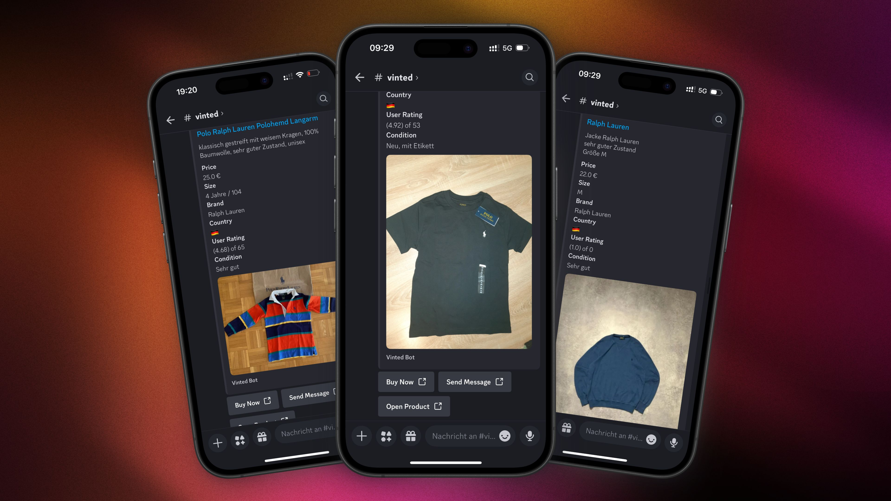

# Vinted Monitor Discord Bot

A Discord bot that monitors Vinted for new clothing items based on configurable search terms and posts them to a specified Discord channel.



## Features

- **Real-time monitoring** of Vinted marketplace for new listings matching your search terms
- **Automated Discord notifications** with detailed product information:
  - Title, price, size, brand, and condition
  - Seller rating and location
  - Up to 4 product images
- **Interactive buttons** for direct actions:
  - Buy the item
  - Message the seller
  - View the full product listing
- **Smart duplicate detection** to avoid repeated notifications
- **Configurable search parameters** including refresh rate and search terms

## Project Structure

```
vinted-monitor/
├── src/
│   ├── api/
│   │   ├── auth.py         # Vinted API authentication
│   │   └── vinted.py       # Vinted API interaction
│   ├── discord_utils/
│   │   ├── bot.py          # Discord bot implementation
│   │   ├── embeds.py       # Message formatting
│   │   └── views.py        # Interactive buttons
│   ├── models/
│   │   ├── config.py       # Configuration management
│   │   ├── database.py     # Product storage
│   │   └── product.py      # Product data model
│   ├── utils/
│   │   └── logger.py       # Logging functionality
│   └── main.py             # Entry point
└── README.md
```

## Requirements

- Python 3.7 or higher
- Required packages:
  - discord.py
  - requests
  - asyncio

## Installation

1. Clone the repository:
   ```bash
   git clone https://github.com/yourusername/vinted-monitor.git
   cd vinted-monitor
   ```

2. Install dependencies:
   ```bash
   pip install -r requirements.txt
   ```

3. Create a `config.json` file in the project root:
   ```json
   {
     "token": "YOUR_DISCORD_BOT_TOKEN",
     "channel_id": 123456789012345678,
     "search_terms": ["ralph lauren", "nike"],
     "refresh_delay": 3,
     "max_images_per_post": 4
   }
   ```

## Usage

Start the bot by running:

```bash
python src/main.py
```

The bot will:
1. Connect to Discord using your bot token
2. Authenticate with the Vinted API
3. Begin monitoring Vinted for products matching your search terms
4. Post new listings to your specified Discord channel

## Configuration Options

- **token**: Your Discord bot token
- **channel_id**: The Discord channel ID where product notifications will be sent
- **search_terms**: List of keywords to search for on Vinted
- **refresh_delay**: Time between searches in seconds
- **max_images_per_post**: Maximum number of product images to include (1-4)

## Logging

Activity and errors are logged to:
- Console output
- `vinted_monitor.log` file in the project root

## Notes

- The bot currently filters for products from Germany only
- Product IDs are stored in `products.json` to prevent duplicate notifications
- The authentication system is designed for the Vinted API

## License

This project is provided for educational purposes. Please ensure your usage complies with Vinted's terms of service.